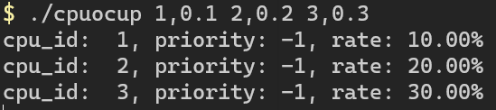

# cpuocup

cpuocup is a simple tool to consume cpu resources. I wrote it just for fun and to experience using Copilot. It is not very useful maybe.

## Compile

```bash
git clone https://github.com/caibingcheng/cpuocup.git
cd cpuocup
g++ main.cpp -o cpuocup -pthread
```

## Usage

```bash
cpuocup 0.5
#set thread 0 to 50% usage
cpuocup 1,0.5
#set thread 1 to 50% usage, and bind to cpu 1
```

## Help message

The help message is almostly wrote by Copilot. I just modify some words and add some comments for it.

```bash
$ cpuocup --help

NAME
    cpuocup - set cpu userspace usage rate
VERSION
    v0.1.0
USAGE
    cpuocup [rate] [cpu_id,rate] [cpu_id,priority,rate] [cmd,rate] [cmd,priority,rate] ...
DESCRIPTION
    This program is used to set cpu rate. Max 16 threads are supported at the device.
    rate: thread rate, 0.0 <= rate <= 1.0
    cpu_id: cpu id, -1 means thread not bind any cpu, range: [-1, 15]
    priority: thread priority, range: [0, 99]
    cmd: f, r, F, R
        f: set to all threads
        r: set to all threads which is not specific
        F: set to all threads, and bind to corresponding cpu
        R: set to all threads which is not specific, and bind to corresponding cpu
EXAMPLE
    cpuocup 0.5 0.9
        set thread 0 to 50% usage, and thread 1 to 90% usage
    cpuocup 1,0.5
        set thread 1 to 50% usage, and bind to cpu 1
    cpuocup 1,20,0.5
        set thread 1 to 50% usage, and bind to cpu 1, and set thread priority to 20
    cpuocup f,0.5
        set all threads to 50% usage
    cpuocup 1,20,0.5, r,40,0.9
        set thread 1 to 50% usage, and bind to cpu 1, and set thread priority to 20
        set all threads which is not specific to 90% usage, and set thread priority to 40, and bind to corresponding cpus
AUTHOR
    Written by caibingcheng.
REPORTING BUGS
    Report bugs to jack_cbc@163.com.
COPYRIGHT
    This is free software: you are free to change and redistribute it.
    There is NO WARRANTY, to the extent permitted by law.
```

## Example

- bind thread 1 to cpu 1 and set it to 10% usage
- bind thread 2 to cpu 2 and set it to 20% usage
- bind thread 3 to cpu 3 and set it to 30% usage



`top -1 -H` result.


